# 📋 Kế hoạch Thống nhất Hệ Thống Token Màu Sắc (Color Tokens Unification Plan)

> **Mục tiêu**: Chuẩn hóa và tinh gọn hệ thống token màu sắc cho toàn bộ dự án `svelte-chd`. Chuyển từ việc phân mảnh nhiều alias / dùng trực tiếp bảng mã stone sang hệ thống **Semantic Token** mạch lạc, dễ hiểu.  
> **Cam kết**: Giữ nguyên 100% phong cách thiết kế, tone màu, độ tương phản (anti-glare/matte), không làm thay đổi giao diện thực tế. Tương lai khi muốn thay đổi color scheme, chỉ cần cập nhật định nghĩa token tại Design Concept / Config là toàn bộ giao diện tự động đồng bộ.

---

## 🔍 I. Phân Tích Thực Trạng Hiện Tại (Current State Analysis)

Theo nội dung phân tích từ [job-need-do.md](file:///home/hajtran/dev/svelte-chd/job-need-do.md) và [LAYOUT_DESIGN_CONCEPT.md](file:///home/hajtran/dev/svelte-chd/LAYOUT_DESIGN_CONCEPT.md):

1. **Quá nhiều tên trùng lặp (Aliases Overload)**:
   - `#5F6E56` (Xanh rêu): được đặt tên là `moss`, `forest`, `accent`. Hover `#4A5642` có `moss-hover`, `forest-hover`, `accent-deep`.
   - `#A3764A` (Đất nung / Ochre): được đặt tên là `ochre`, `ocher`, `terracotta`, `secondary`, `accent-warm`.
   - `#2B2A24` (Nền tối / Charcoal): được đặt tên là `stone-900`, `charcoal`.
   - `#1E1D19` (Nền siêu tối): được đặt tên là `stone-950`, `charcoal-dark`.
   - `#D6CBAE` (Nền chính): được đặt tên là `sand`, `stone-100`.
   - `#DFD5B9` (Nền thẻ): được đặt tên là `sand-card`, `stone-50`.
   - `#C7BB98` (Nền phụ): được đặt tên là `sand-alt`, `stone-200`.

2. **Trộn lẫn 3 trường phái đặt tên (Semantic vs. Brand Palette vs. Raw Stone Scale)**:
   - Một số component dùng `text-primary` (`#2A2720` - Ink), trong khi component khác dùng `text-moss` hoặc `text-stone-900`.
   - Cột màu `stone-50` -> `stone-950` thực chất không phải grayscale chuẩn của Tailwind mà là dải màu riêng của CHD (cream → beige → brown → charcoal). Khi dùng `text-stone-500` lập trình viên không hiểu ý nghĩa chức năng (semantic reason).

---

## 🎨 II. Thiết Kế Hệ Thống Semantic Token Chuẩn (Target Semantic Color Tokens)

Tổ chức lại hệ thống token theo 6 nhóm chức năng (Functional Token Groups):

```mermaid
graph TD
    A[Color System] --> B[Brand Tokens]
    A --> C[Surface Tokens]
    A --> D[Content / Typography Tokens]
    A --> E[Border Tokens]
    A --> F[Inverse / Dark Tokens]
    A --> G[Status / Utility Tokens]

    B --> B1[primary: #5F6E56 - Moss]
    B --> B2[primary-hover: #4A5642]
    B --> B3[secondary: #A3764A - Terracotta / Warm Accent]
    B --> B4[secondary-hover: #8C633C]

    C --> C1[bg-background: #D6CBAE - Sand]
    C --> C2[bg-surface: #DFD5B9 - Sand Card]
    C --> C3[bg-surface-muted: #C7BB98 - Sand Alt]

    D --> D1[text-foreground: #2A2720 - Ink / Heading]
    D --> D2[text-foreground-muted: #5C5646 - Body text]
    D --> D3[text-foreground-subtle: #8A7E64 - Overline / Caption]

    E --> E1[border-border: #C7BB98]
    E --> E2[border-border-strong: #B0A27E]

    F --> F1[bg-inverse: #1E1D19 / #2B2A24 - Charcoal]
    F --> F2[text-inverse-foreground: #DFD5B9]

    G --> G1[overlay / black-alpha]
```

### Bảng Quy Đổi Chi Tiết (Mapping Matrix)

| Nhóm Token | Token Mới (Semantic) | Giá trị HEX | Lớp Cũ Tương Đương | Mục Đích Sử Dụng |
| :--- | :--- | :--- | :--- | :--- |
| **Brand** | `primary` | `#5F6E56` | `moss`, `forest`, `accent` | Màu nhận diện rừng rêu Tây Nguyên, nút CTA chính, tiêu đề nổi bật |
| | `primary-hover` | `#4A5642` | `moss-hover`, `forest-hover`, `accent-deep` | Hover cho nút primary |
| | `primary-dark` | `#353E2F` | `moss-dark` | Điểm nhấn rêu đậm |
| | `secondary` | `#A3764A` | `terracotta`, `ochre`, `ocher`, `accent-warm` | Màu đất nung bazan, badge Best Sell, giá tour, hover link |
| | `secondary-hover` | `#8C633C` | `ochre-hover` | Hover cho secondary |
| **Surface** | `background` (hoặc `bg-sand`) | `#D6CBAE` | `sand`, `stone-100` | Nền chính toàn trang (ấm, chống lóa) |
| | `surface` (hoặc `bg-card`) | `#DFD5B9` | `sand-card`, `stone-50` | Nền thẻ tour, blog card, form container, modal |
| | `surface-muted` (hoặc `bg-alt`) | `#C7BB98` | `sand-alt`, `stone-200` | Nền section xen kẽ phân tách khối |
| **Content** | `foreground` | `#2A2720` | `stone-900`, `stone-800`, `primary` (cũ) | Tiêu đề Heading (H1-H3), văn bản chữ chính |
| | `foreground-muted` | `#5C5646` | `stone-600`, `stone-500` | Nội dung mô tả (Body text), phụ đề |
| | `foreground-subtle` | `#8A7E64` | `stone-400` | Overline, step marker, caption mờ |
| **Border** | `border` | `#C7BB98` | `stone-200`, `border-sand-alt` | Viền thẻ, đường phân cách card |
| | `border-strong` | `#B0A27E` | `stone-300` | Viền đậm, focus border |
| **Inverse** | `inverse` | `#1E1D19` / `#2B2A24` | `charcoal`, `charcoal-dark`, `stone-900`, `stone-950` | Nền tối cho Hero banner, Footer |
| | `inverse-foreground` | `#DFD5B9` | `stone-100`, `stone-50` (on dark) | Chữ hiển thị trên nền tối (Hero/Footer) |

---

## 📝 III. Danh Sách Công Việc Cần Thực Hiện (Actionable Task List)

### Phase 1: Cập Nhật Tài Liệu Thiết Kế (Design System Documentation)
- [x] **Task 1.1**: Đồng bộ bảng màu trong [LAYOUT_DESIGN_CONCEPT.md](file:///home/hajtran/dev/svelte-chd/LAYOUT_DESIGN_CONCEPT.md) theo chuẩn Semantic Tokens (Brand, Surface, Content, Border, Inverse).
- [x] **Task 1.2**: Ghi chú rõ ràng quy tắc ánh xạ và nguyên tắc không đổi mã HEX/style visual.

### Phase 2: Cấu Hình Tailwind Theme Config
- [x] **Task 2.1**: Tinh chỉnh [front-end/tailwind.config.js](file:///home/hajtran/dev/svelte-chd/front-end/tailwind.config.js):
  - Khai báo các semantic tokens mới (`primary`, `secondary`, `background`, `surface`, `foreground`, `border`, `inverse`).
  - Giữ lại các alias cũ an toàn để không làm vỡ giao diện đang chạy.
  - Loại bỏ các tên thừa/lỗi chính tả (`ocher` vs `ochre`, `forest`).
  - Giữ nguyên dải `stone` (11 shades) cho các nhu cầu vi chỉnh tonal nếu cần thiết mà không phụ thuộc trực tiếp.

### Phase 3: Rà Soát & Thay Thế Naming Trong Codebase Frontend (`front-end/src/`)
- [x] **Task 3.1**: Thay thế các component Layout, Header, Navbar, Footer:
  - `src/lib/modules/nav-bar/`
  - `src/lib/modules/mobile-menu/`
  - `src/lib/base/base-footer.svelte`
  - `src/routes/+layout.svelte`
- [x] **Task 3.2**: Thay thế các component Base UI:
  - `src/lib/base/` (`base-logo`, `base-locale-switcher`, `base-scroll-to-top`, `base-booking-modal`, `base-tour-detail-modal`, `base-blog-detail-modal`...)
- [x] **Task 3.3**: Thay thế các module trang:
  - `src/lib/modules/home-page/` (Hero, Why CHD, Day Tours, Highland Tours, Experiences, Testimonials, Featured Slider, Contact, Plan Your Trip)
  - `src/lib/modules/tour-page/` (Tour Card, Tour Details, Tour Gallery)
  - `src/lib/modules/blog-page/` (Blog Page, Filter Pills, Post Cards)
  - `src/lib/modules/about-page/` (About Hero, Timeline, Team Members, Legal, CTA)
  - `src/lib/modules/contact-page/` (Header, Address / Map, Reviews)
  - Các route trong `src/routes/[lang]/`

### Phase 4: Kiểm Thử và Đảm Bảo Chất Lượng (Quality Gates & Verification)
- [x] **Task 4.1**: Chạy `pnpm check` (Svelte-check & TypeScript) ở frontend (0 errors, 0 warnings).
- [x] **Task 4.2**: Chạy `pnpm lint:all` và `pnpm format:all` để đảm bảo chuẩn code và formatting.
- [x] **Task 4.3**: Chạy `pnpm test` (16/16 Unit test passed & 5/5 Playwright E2E passed).
- [x] **Task 4.4**: Kiểm tra và đối soát 100% mã màu HEX (Color Parity Verification).
- [x] **Task 4.5**: Cập nhật đồ thị tri thức với `/graphify`.
